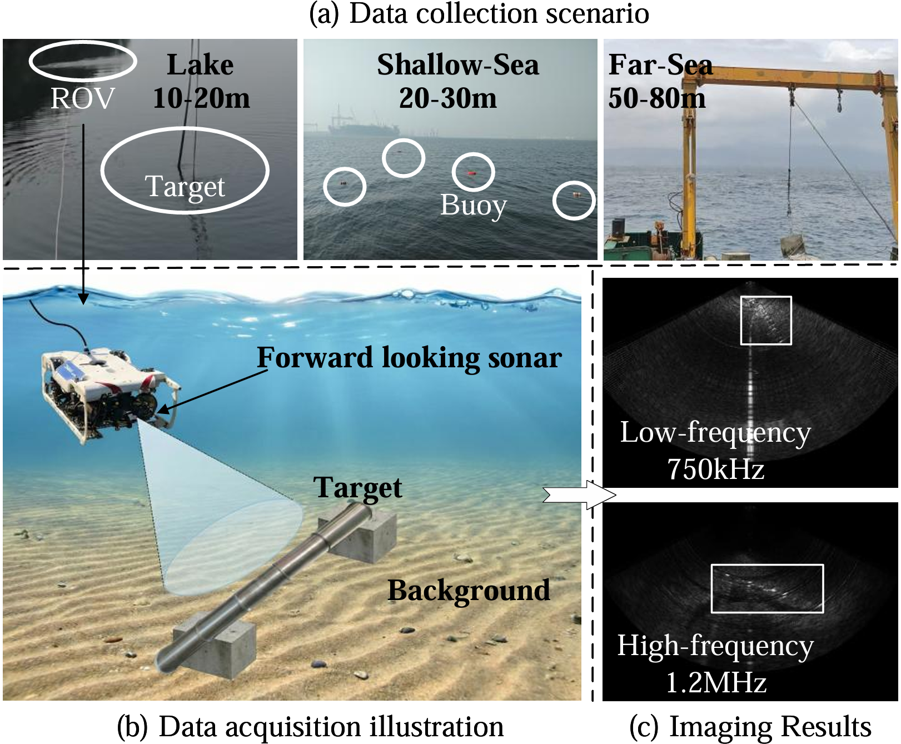

# OpenSID: An Open-set Sonar Image Dataset

**OpenSID** is a real-world forward-looking sonar image dataset constructed for **open-set and long-tailed sonar image recognition (Sonar-OLTR)**. Unlike existing cropped sonar datasets, OpenSID provides **full-frame** images that preserve the complete target–background context, making it well-suited for studying open-world recognition under realistic conditions.

---

## Collection Scenes & Sample Images

The figure below shows the three collection environments and representative sonar image samples from OpenSID.

  

  <em>Figure 1. Collection sites (Bohai Bay, Qiandao Lake, South China Sea) and example forward-looking sonar images across the 8 categories of OpenSID.</em>

---

## Data Collection

The data were collected across three distinct marine environments in China — **Bohai Bay, Qiandao Lake, and the South China Sea** — to ensure diversity in water conditions, seabed types, and acoustic backgrounds.

- **Equipment.** A cable-controlled Remotely Operated Vehicle (ROV) equipped with a multi-beam forward-looking sonar was used for acquisition. Two sonar models were employed: **Oculus M750d** and **Oculus M1200d**.
- **Acquisition protocols.**
  - In **Bohai Bay** and **Qiandao Lake**, targets were suspended underwater with thin ropes and captured by the ROV from multiple perspectives.
  - In the **South China Sea**, targets were placed directly on the seabed with their coordinates recorded, and then acquired by the ROV.
- **Multi-frequency imaging.** During acquisition, the sonar was switched between **high and low frequencies (750 kHz / 1.2 MHz)** to enrich the imaging conditions, and the category label of each sonar recording was logged.

## Dataset Construction

From approximately **10,000 raw sonar recordings**, we removed highly redundant frames and retained a low-redundancy subset, which was then converted into sonar images. To ensure label reliability, **two sonar engineers who participated in the data collection independently verified the category of each image**.

The final OpenSID dataset contains **9,194 forward-looking sonar images across 8 categories**, exhibiting a natural long-tailed distribution (imbalance factor = 7.14).

## Highlights

- 🌊 **Real-world, multi-site collection** (Bohai Bay, Qiandao Lake, South China Sea)
- 🖼️ **Full-frame images** preserving complete target–background context (not cropped chips)
- 📡 **Multi-frequency acquisition** (750 kHz / 1.2 MHz) with two sonar models (Oculus M750d / M1200d)
- ⚖️ **Naturally long-tailed**: 9,194 images across 8 categories (IF = 7.14)
- ✅ **Expert-verified labels** by two participating sonar engineers
